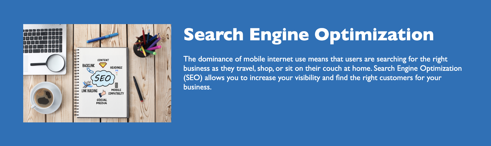

# Horiseon Refactor

## Description

Horiseon is a marketing agency that offers sevices for search engine optimization, online reputation management, and social media marketing. 

This site lists and describes all of the services they offer, and it outlines the benefits of using their services. all of this is contained in an attractive, streamlined landing page that has been refigured to be accessible and optimized. 

[Click here to visit the Horiseon Website](https://danidelia253.github.io/horiseon-refactor/).

[Click here to visit the Project Repository](https://github.com/DaniDelia253/horiseon-refactor).

## Table of Contents

* [Usage](#usage)
* [Credits](#credits)
* [License](#license)

## Usage

Use the links at the top of the page to navagate the landing page:

* **Horiseon** link loads the main manding page
    
* **Search Engine Optimization** link jumps to the section of the page that describes Search Engine Optimization services
    
* **Online Reputation Management** link jumps to the section of the page that describes Online Reputation Management
    
* **Social Media Marketing** link jumps to the section of the page that describes Social Media Marketing services
    

## Credits

List your collaborators, if any, with links to their GitHub profiles.

If you used any third-party assets that require attribution, list the creators with links to their primary web presence in this section.

If you followed tutorials, include links to those here as well.

## License

The last section of a good README is a license. This lets other developers know what they can and cannot do with your project. If you need help choosing a license, use [https://choosealicense.com/](https://choosealicense.com/)

---

🏆 The sections listed above are the minimum for a high-quality README, but your project will ultimately determine the content of this document. You might also want to consider adding the following sections.

## Badges

Badges aren't _necessary_, per se, but they demonstrate street cred. Badges let other developers know that you know what you're doing. Check out the badges hosted by [shields.io](https://shields.io/). You may not understand what they all represent now, but you will in time.

## Features

If your project has a lot of features, consider adding a heading called "Features" and list them there.

## Contributing

If you created an application or package and would like other developers to contribute it, you will want to add guidelines for how to do so. The [Contributor Covenant](https://www.contributor-covenant.org/) is an industry standard, but you can always write your own.

## Tests

Go the extra mile and write tests for your application. Then provide examples on how to run them.

---
© 2021 Trilogy Education Services, LLC, a 2U, Inc. brand. Confidential and Proprietary. All Rights Reserved.
